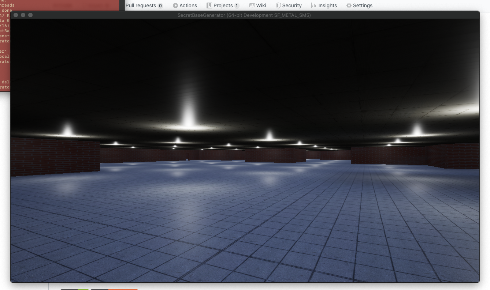

# SecretBaseGenerator (Experiment)

A procedural generator for making secret bases in Unreal Engine. However, eventually it will
hopefully be extended to be engine agnostic!

## Project Goals
**Generate sequences of rooms across multiple levels which look like they could be an underground
base (think Black Mesa from Half-Life).**

The generation part of this should be module enough so it can be made into a little library. Perhaps
it could even be agnostic of game engine.

## Current Status
At the moment the game simply generates a set of rooms

### Screenshots
Video demo: https://youtu.be/1cxAHuMUg9w

## Contributing
Currently I have not made plans yet for contributions but anyone is welcome to create issues (either
about code, a feature request, anything!), and make pull requests. It would be a good idea to post
on the issue you wish to work on and tag me (@callumW).

## Roadmap
- [ ] Generate sequence of rooms at single level
- [ ] Generate multiple levels connected by stairwells
- [ ] Set rooms to be different types (and make this reflected in the generation of the room, e.g.
    a laboratory would have different requirements than an office)
- [ ] Populate rooms randomly with themed items (e.g. Office would have desks, computers, etc)

## License
This project is licensed under the MIT License. See [LICENSE](LICENSE) for further details.
